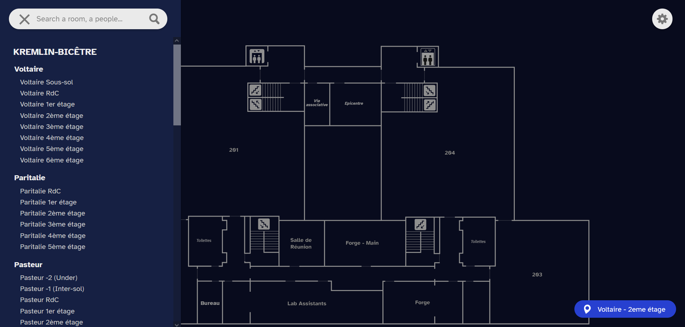

# September 2023 (v.2023-9.1) Release

## Welcome Epimap v2 !

It's back to school time for Epimap, with a new version!
We have integrated references in the maps, linked to json data, enabling advanced searches (by person, by keyword...) and complete room informations on UI. We've also taken the opportunity to rework the UI.

### New Features:

- Search system: You can search efficiently for a room (ie. Cisco), a type of room (ie. SM) or the name of a people (ie. Claire Lecocq). Search results take you straight to the right map.

- Room information: Clicking on a room displays some information about it, including the people assigned to it.

## Maps update:

The following maps have been updated according to v2 Format:

- Kremlin-Bicêtre Voltaire Groundfloor to 6th floor
- Kremlin-Bicêtre Paritalie 1st to 5th floor

## Fixes:

- Fix the use of direct links to maps on smartphones
- Replace XhttpRequest

## Issues:

Opened issues: #44, #45, #49, #51, #52, #53, #56, #57, #58

Closed issues:  #6 #30 #36 #40 #41